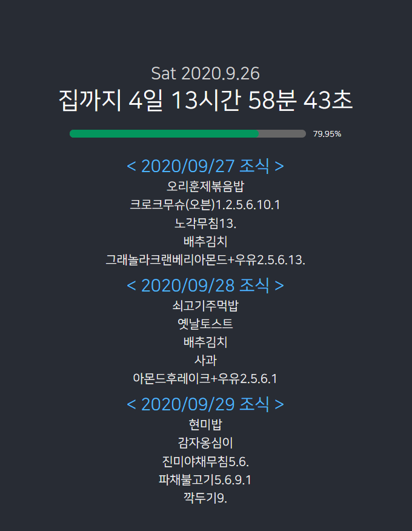

# School Public Board

## Development

`npm i` 로 초기에 필요한 node_modules를 설치 할 수 있습니다.  
`npm run-script start` 로 웹 사이트를 실행 할 수 있습니다.(코드 변경시 자동 적용)  
`npm run-script build` 로 Production에서 사용할 웹 사이트를 빌드 할 수 있습니다.
`npx serve build` 로 빌드한 웹 사이트를 싱핼 할 수 있습니다.

### [Firebase로 프로덕션 업로드](https://firebase.google.com/docs/cli)

`npm i -g firebase-tools` 로 Firebase CLI를 설치 할 수 있습니다.
`npx firebase login` 으로 로그인 합니다.
`npx firebase init` 으로 Firebase Hosting을 불러옵니다. public 폴더 이름은 build로 합니다.
`npx firebase deploy` 로 Firebase Hosting에 업로드 합니다.

### 자동 웹 사이트 실행
`/etc/xdg/lxsession/LXDE-pi/autostart` 에
`chromium-browser --start-fullscreen --start-maximized --app=https://public-screen.web.app/`를 추가합니다.

## 기능

- [x] 현재 시간 표시
- [x] 집 갈 때 까지 남은 시간 표시
- [x] 집 가는 시간 자동 설정
- [x] 급식 표시

## 이슈

- `npm i`를 **라즈베리파이** 환경에서 설치하는 것은 아주 오래 걸리고 설치가 자주 실패합니다.  
  `npx serve build`로 빌드한 웹 사이트만 실행 하는걸 권장합니다.
- `String.prototype.replaceAll` 함수가 **라즈베리파이** 환경에서는 존재 하지 않습니다.  
  replaceAll(**'A'**, **'B'**) 꼴의 함수를 replace(**/A/**, **'B'**) 로 대신해 주세요.
- `open_api_key`가 없으면 급식의 정보가 일부(조식)만 표시 될 수도 있습니다.
